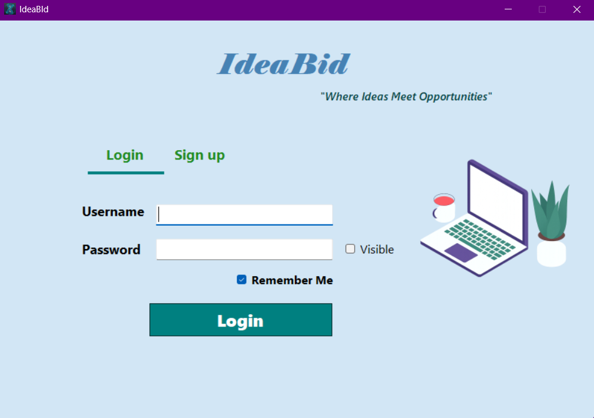
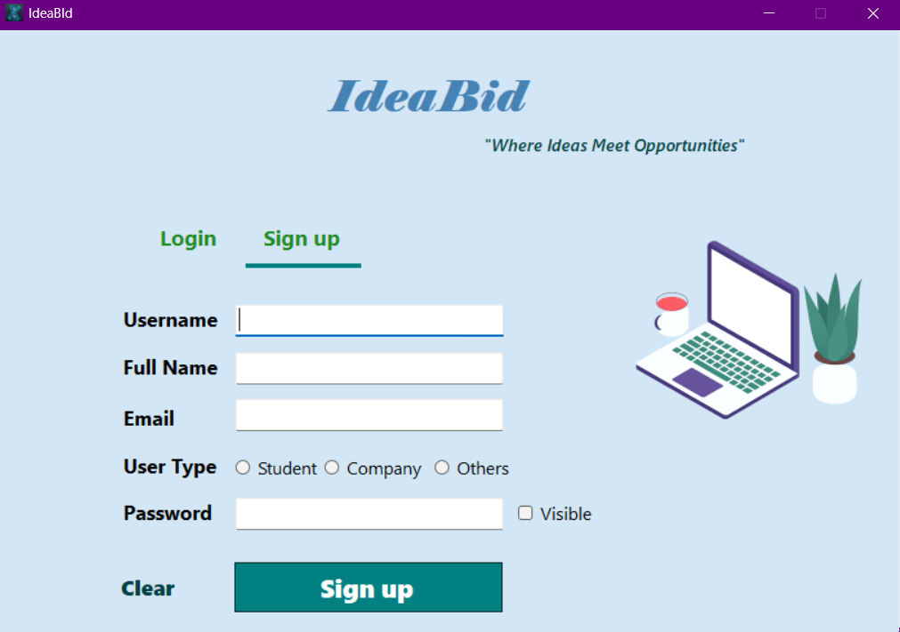
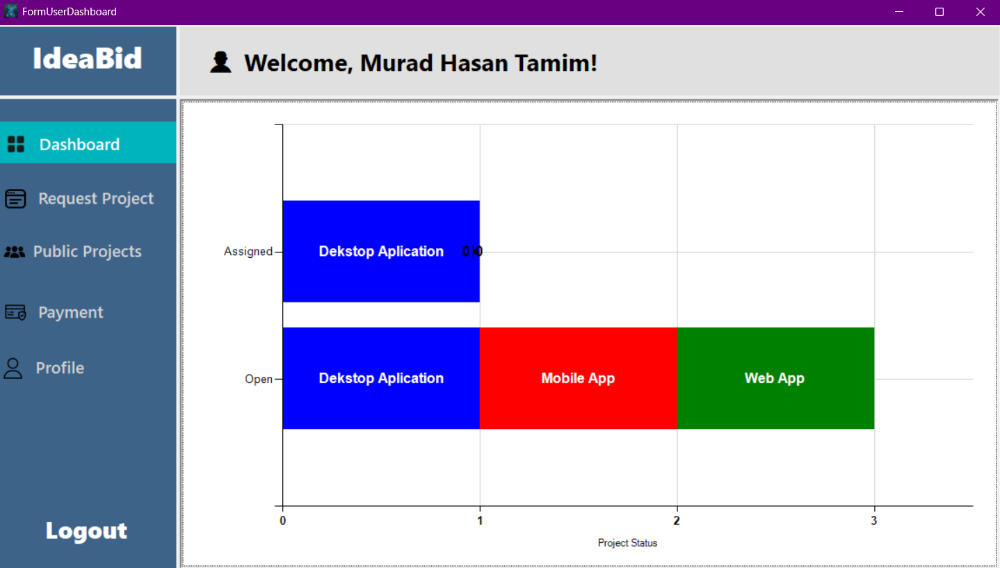
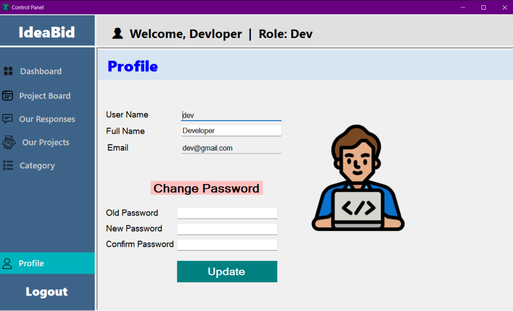
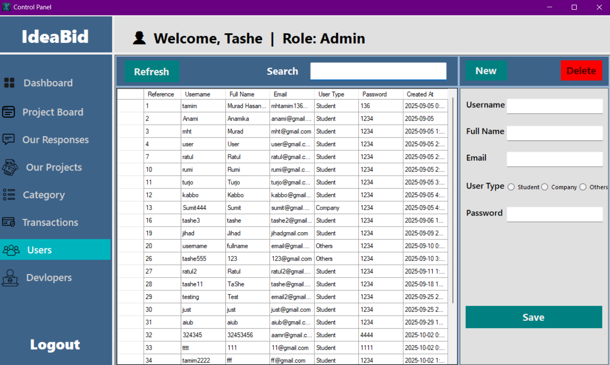

# 💡 IdeaBid – Project Request & Management Platform

## 📘 Overview
IdeaBid is a C# and SQL Server-based platform that connects project requesters with developers and administrators.  
Users can create requests, receive responses, make payments, and manage their project transactions efficiently.

## 🧰 Features
- User registration and login system  
- Role-based access control (Admin, Developer, User)  
- Project request and response management  
- Payment and transaction tracking  
- Category and status management  

## 🧑‍💻 Technologies Used
- **Language:** C# (.NET Framework, WinForms)  
- **Database:** Microsoft SQL Server  
- **UI Library:** MetroFramework  

## ⚙️ Setup Instructions
1. Clone or download the project repository  
2. Open the solution file (`.sln`) in Visual Studio  
3. Configure your SQL Server connection string in `Database.cs`  
4. Run the provided `IdeaBid_Database_Script.sql` file in SQL Server  
5. Build and Run the project 🎯  

## 🧩 Database Structure
Includes the following main tables:
- AdminInfo  
- DevInfo  
- UserInfo  
- Category  
- ProjectStatus  
- ProjectRequest  
- ProjectResponse  
- PaymentTransaction  
- PaymentMethod  
- PaymentLog  

## 🖼️ Project Screenshots

### 🔹 Login 

### 🔹 Signup

### 🔹 User Dashboard

### 🔹 Developer Profile

### 🔹 User Manager View

## 🧑‍🏫 Author
Developed by **[Murad Hasan Tamim]**  
Course: **OOP 2 (C# Project)**  
Institution: **[American International University-Bangladesh]**  

## 🔗 GitHub Repository
👉 [GitHub Link Here](https://github.com/mhtamim136/IdeaBid--Project-Request-Management-Platform.git
